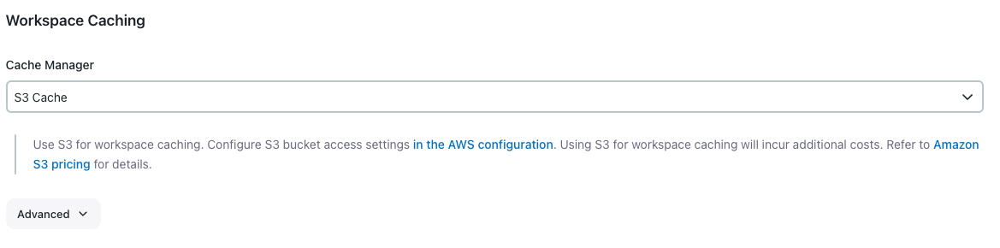
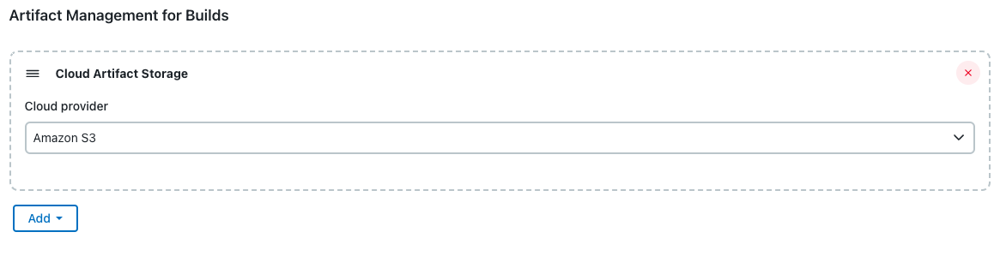
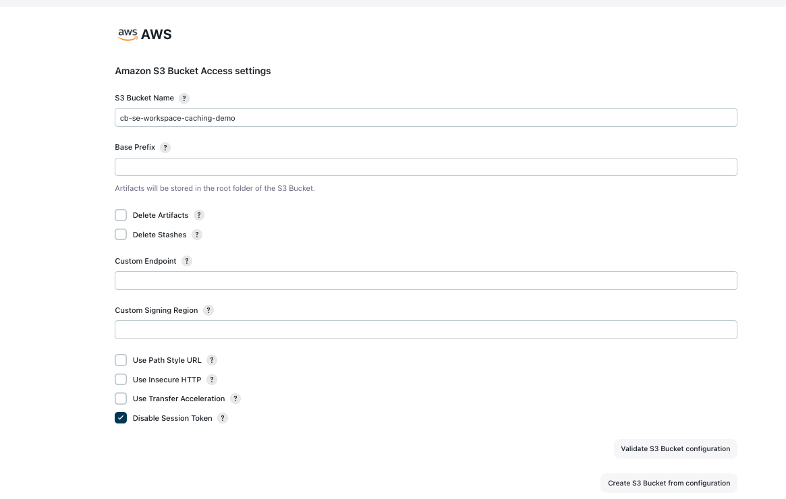
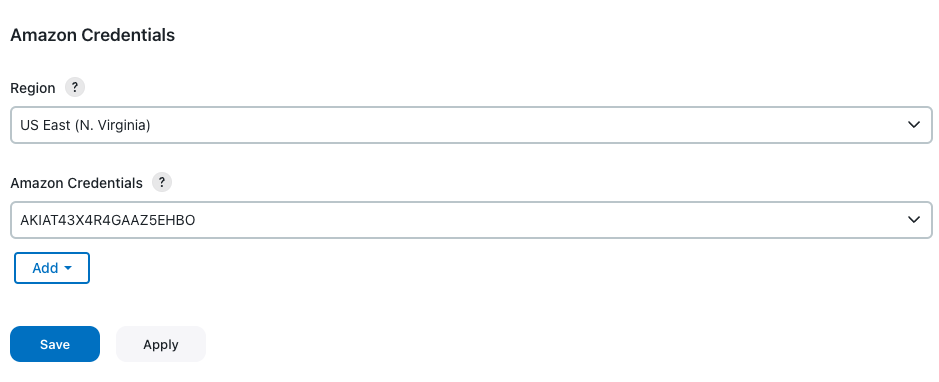
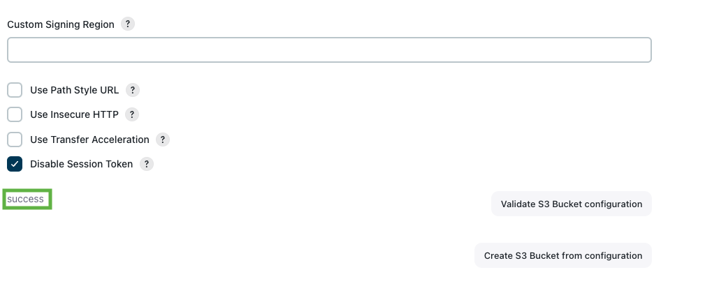
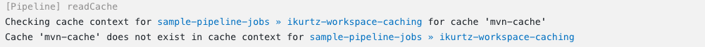
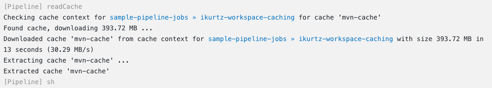
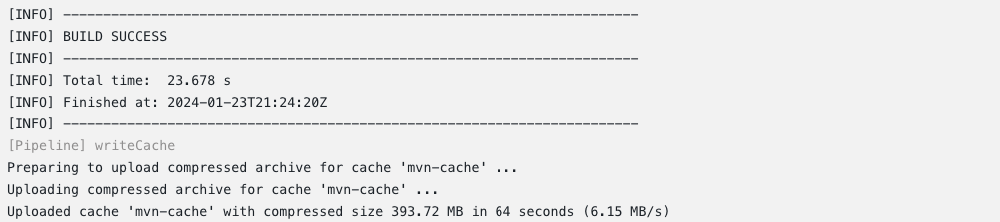
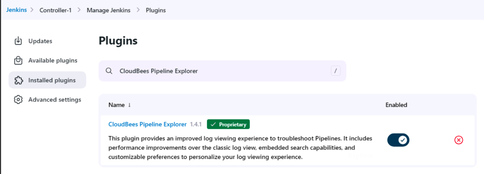

# LAB 1: Configuring High Availability (HA) For Your CloudBees CI Managed Controller

In this exercise, you will complete the following tasks:

- Task 1: Verify that your controller runs in High Availability mode.
- Task 2: Switch to another replica.
- Task 3: Enable developer mode.
- Task 4: Switch back to the original replica.
- Task 5: Review the HA information displayed by the replica when running in developer mode.

## Verify that Your Managed Controller Runs in HA mode
As you are using a modern CloudBees CloudBees CI platform from your operations center’s root level:

- Verify that `Controller-2` has two replicas and both are available:


- Navigate to **Controller-2 > Manage Jenkins > High Availability**
- Review the information displayed on the High Availability screen about the number of replicas and the replica you are currently using:


## Switch to Another Replica
- Select the `Reset sticky session` button and reload the **High Availability** screen as many times as needed until you are randomly assigned to the other replica.


## Enable developer mode
- In the **High Availability** screen, check the **Enable developer mode** and select **Apply**.
- Reload the **High Availability Screen** and verify the information displayed.

Sample output:


## Switching Back to the Original Replica
- Navigate to the **Manage Jenkins > High Availability** screen.
- Select the `Reset sticky session` button and reload the **High Availability** screen as many times as needed until you are back to the original replica (the second one in our case).

## Review the HA Information Displayed by the Replica When Running in Developer Mode
- On `Controller-2` navigate to **Team-CD > Job**.
- Run the `Job` Pipeline by selecting **Build Now** on the left navigation pane.
- Verify that the running build adds the name of the replica owning the build to its name.

Example 1. Sample output:


# LAB 1-2: Improving Business Continuity with CloudBees CI Horizontal Scaling

In this exercise, you will complete the following tasks:

- Task 1: Create a new folder.
- Task 2: Verify that the new folder appears on the other replica.
- Task 3: Switch back to the original replica.
- Task 4: Create a new Pipeline.
- Task 5: Verify that the new Pipeline appears on the other replica.
- Task 6: Completely delete the folder and verify that the replicas are in sync.

## Create a New Folder
Verify that `Controller-2` is running in developer mode:


- At `Controller-2` 's root, create a new folder, `task-3-folder`.


## Verify the New Folder Appears on the Other Replica
- Switch to the other `Controller-2` replica and verify that the folder exists and the replicas are synchronized:


## Switching Back to the Original Replica
- Navigate to **Controller-2 > Manage Jenkins > High Availability**
- Select the `Reset sticky session` button and reload the **High Availability** screen as many times as needed until you are randomly assigned to the original replica (**qtv8r** in the example screenshots).


## Create a New Standalone Pipeline
Inside the `task-3-folder`, create a new Pipeline titled `data-synced-pipeline`. Scroll to the bottom of the Job configuration screen and under the **Pipeline** section, copy and paste the following Jenkinsfile into the **Script** block:

```
pipeline {
    agent { label 'linux' }
    stages {
        stage('data-sync') {
            steps {
                echo 'Pipeline for Lab 3.1'
                echo 'Data synchronization between controller replicas'
            }
        }
    }
}
```

click **Save** and then **Build Now** to run the Pipeline. Navigate back to the root level of the `task-3-folder` and you should see the following output:


## Verify the New Standalone Pipeline Appears on the Other Replica
- Switch to the other `Controller-2` replica and verify that the Pipeline exists and the replicas are synchronized:


## Delete the Folder and Verify that the Replicas are in Sync
- Remove the `task-3-folder` from `Controller-2`.
- Verify that the replicas are in sync. Visit both replicas to verify that the folder doesn’t appear.


# LAB 1-3: Load Distribution with CloudBees CI Horizontal Scaling

In this exercise, you will complete the following tasks:

- Task 1: Create a Pipeline.
- Task 2: Configure the Pipeline to be executed every minute.
- Task 3: Verify that the builds are randomly distributed.
- Task 4: Change the Pipeline configuration to avoid executions every minute.

## Create a Standalone Pipeline
- Navigate to `Controller-2` and verify that the controller runs in developer mode.
- Create a new Pipeline titled `hahs-lab-3-cron-job`. Scroll to the bottom of the Job configuration screen and under the **Pipeline** section, copy and paste the following Jenkinsfile into the **Script** block:

```
pipeline {
    agent { label 'linux' }
    triggers {
        cron '* * * * *'
    }
    stages {
        stage('cron') {
            steps {
                echo 'Controller-2 Cron Job'
            }
        }
    }
}
```
Sample Output:


- Run the Pipeline once to enable the cron trigger by clicking **Build Now**.

## Verify that Builds are Being Randomly Distributed
- Wait a few minutes to allow CloudBees CI to run the Pipeline several times.


- Wait for several executions
- Open the **Console Output** for any of the builds, and using the **Next Build** and the **Previous Build** entries on the left navigation pane, browse between the different builds.
- Verify that each build has been randomly executed by one of the replicas.


## Disable the Standalone Pipeline to Avoid Executions Every Minute
- On the Job Configuration screen for the `hahs-lab-3-cron-job` Pipeline, select **Configure**.
- Uncheck the **Enabled** checkbox at the top right corner.
- Select **Save**.


# LAB 1-4: Active-Active Automatic Failover with CloudBees High Availability

In this exercise, you will complete the following tasks:

- Task 1: Create a Pipeline.
- Task 2: Access to the Kubernetes Web Dashboard
- Task 3: Run the Pipeline.
- Task 4: Delete the replica running the build.
- Task 5: Verify the build adoption.
- Task 6: Verify that a new replica is created.

## Create a Standalone Pipeline
- Navigate to `Controller-2` and verify that it is running in developer mode.
- Create a new Pipeline titled `long-running-job`. Scroll to the bottom of the Job configuration screen and under the **Pipeline** section, copy and paste the following Jenkinsfile into the **Script** block:

```
pipeline {
    agent { label 'linux' }
    stages {
        stage('Long running job') {
            steps {
                sh '''
                env | sort
                for i in 1 2 3 4 5 6 7 8 9 10 11 12 13 14 15 16 17 18 19 20
                do
                  echo "sleep #$i"
                  echo "Controller-2 long running job"
                  date
                  sleep 10s
                done
                '''
            }
        }
    }
}
```
Sample Output:


## Accessing the Kubernetes Web Dashboard
- Open the file `token.txt` (stored in your VM Desktop), and copy the auth token for the Kubernetes Web Dashboard.


- Open the following URL using the Chrome browser https://dashboard:32000.
- Paste the token and select **Sign in** to access the Kubernetes Web Dashboard.


- Select the Kubernetes namespace `cloudbees-core` on the dropdown list at the top of the screen, and select the **Pods** entry on the **Workloads** section on the left navigation pane. This screen displays all the controller replicas.


## Run the Standalone Pipeline
- Navigate back to the `controller-2` dashboard.
- Pay attention to the name of the current replica (`controller-2-644bb84b8-hrqsh` in the example).


- Run the Pipeline and open the `Console Output`.
- Review the logs to figure out the replica that is running the job. For the demo, CloudBees CloudBees CI has scheduled the build to the same replica we were browsing (`controller-2-644bb84b8-hrqsh`).

Sample Output:


## Delete the Replica Running the Build
- Open the Kubernetes Web Dashboard on https://dashboard:32000. Depending on the time since your last access, you may need to insert the auth token again.
- Delete the replica (Pod) running the build (`controller-2-644bb84b8-hrqsh` in the example).


## Verify the Build Adoption
- Navigate back to the Pipeline **Console Output**. Reload the page. You can verify that, as the replica used was deleted, you have been assigned to another replica.
- Review the **Console Output** and verify that the Pipeline build has been adopted by the other `controller-2` replica.


## Verify that a New Replica is Created
- Wait a little bit and navigate to the operations center’s dashboard.
- Verify that the CloudBees CI modern platform has automatically created a new replica to replace the deleted one.


# LAB 2: Increasing Velocity with Workspace Caching for CloudBees CI

In this exercise, you will complete the following tasks:
- Verify that the CloudBees Cache Step Plugin, Artifact Manager on S3 Plugin, and the AWS Global Configuration Plugin have been installed on your Managed Controller.
- Verify that the Workspace Caching configuration has been successfully setup and validated.
    - Verify Artifact Manager on S3 Plugin has been successfully setup
    - Verify the target S3 bucket and its configuration in both CloudBees CI and AWS
- Run a sample Maven CI Pipeline that does not yet take advantage of Workspace Caching and review the build logs in the console output
- Run a sample Maven CI Pipeline that does take advantage of Workspace Caching and review the build logs in the console output
- Identify the differences in total build duration between the two aforementioned builds to learn how Workspace Caching can make a significant difference in improving your business

## Introducing Workspace Caching for CloudBees CI
The [CloudBees Cache Step Plugin](https://docs.cloudbees.com/plugins/ci/cloudbees-cache-step) provides `writeCache` and `readCache` Pipeline steps to use separate storage as caches for workspaces. This is useful for builds running on cloud agents that start with empty caches of build tools, or when builds involve temporary files that take much longer to generate than they take to download.

The [CloudBees S3 Cache Plugin](https://docs.cloudbees.com/plugins/ci/cloudbees-s3-cache) provides a cache implementation for these steps based on [AWS S3](https://aws.amazon.com/s3/).

> [!IMPORTANT]
> Using AWS S3 to store workspace caches will incur additional costs from AWS. Refer to the [AWS documentation](https://aws.amazon.com/s3/pricing/?nc=sn&loc=4) for S3 pricing information.

## Verify Configuration of Workspace Caching
Workspace caching is disabled by default. As an administrator, you can enable this setting on the System configuration page. On `Controller-1`, confirm that workspace caching has been properly configured by first selecting **Manage Jenkins > System**. Navigate to **Workspace Caching** and review the current configuration. The **S3 Cache** from the **Cache Manager** list should be selected, as shown in the illustration below.



The S3 cache uses the configuration of the [Artifact Manager on S3 plugin](https://docs.cloudbees.com/plugins/ci/artifact-manager-s3). This plugin permits you to archive artifacts in an S3 Bucket, where there is less need to be concerned about the disk space used by artifacts. We will review the AWS configuration for the S3 bucket we'll be targeting as the cache just after we validate that workspace caching has been enabled for `Controller-1`.

> [!TIP]
> Under **Advanced Options** you can also configure which jobs are able to use the cache with the **Job Include Pattern** and **Job Exclude Pattern** fields.

The **Job Include Pattern** allows you to configure specific jobs that are able to use the configured cache using a comma-separated Ant-style pattern. For example:

- `**` matches all jobs.
- `my-project/**` matches all jobs in the folder `my-project`.
- `*e*` matches all jobs whose name contains the letter **e** that are not in another folder.

This field is empty, which means that all jobs are included by default.

The **Job Exclude Pattern** allows you to exclude an included job. The syntax is the same as the **Job Include Pattern**. However, an empty value means that nothing is excluded that would otherwise be included (for example, if both fields are empty, the workspace caching feature is enabled for all jobs in the CloudBees CI instance).

## Configuring the Artifact Manager for S3
For the CloudBees S3 Cache plugin specifically, the permissions `s3:PutObject`, `s3:GetObject`, `s3:DeleteObject`, and `s3:ListBucket` are needed. For more information on configuring S3, refer to the [Artifact Manager on S3 plugin](https://docs.cloudbees.com/plugins/ci/artifact-manager-s3) documentation. Here is the IAM policy attached to the IAM user we'll be using to connect to Amazon S3:

```
{
    "Version": "2012-10-17",
    "Statement": [
        {
            "Effect": "Allow",
            "Action": [
                "s3:ListBucket",
                "s3:GetBucketLocation"
            ],
            "Resource": "arn:aws:s3:::*"
        },
        {
            "Effect": "Allow",
            "Action": "s3:ListBucket",
            "Resource": "arn:aws:s3:::cb-se-workspace-caching-demo"
        },
        {
            "Effect": "Allow",
            "Action": [
                "s3:PutObject",
                "s3:GetObject",
                "s3:DeleteObject",
                "kms:Encrypt",
                "kms:Decrypt",
                "kms:ReEncrypt*",
                "kms:GenerateDataKey*"
            ],
            "Resource": [
                "arn:aws:s3:::cb-se-workspace-caching-demo/",
                "arn:aws:kms:us-east-1:268150017804:key/73fe2ba6-4124-428d-aaa4-b8e41bd845TY"
            ]
        }
    ]
}
```

Let's take a look at what we need to configure in CloudBees CI to connect to our target AWS S3 bucket for use in workspace caching:

1. Go to **Manage Jenkins > Configure System**.
2. In the **Artifact Management for Builds section**, validate that **Amazon S3** is selected as the Cloud Provider for artifact storage:



3. Navigate to **Manage Jenkins > Amazon Web Services (AWS) Configuration** to validate the name of the target S3 bucket, `cb-se-workspace-caching-demo` and the corresponding AWS IAM credentials needed to connect to it. Let's start by reviewing the bucket configuration:



4. After reviewing the S3 bucket settings, let's validate that we have configured the proper credentials before testing the connection to the `cb-se-workspace-caching-demo` S3 bucket:



>[!NOTE]
> Your AWS account must have the right IAM permissions to access the S3 Bucket, and must be able to `list`, `get`, `put`, and `delete` objects in the S3 Bucket. Please refer to the IAM policy in JSON shared earlier in this lab.

5. It's time to validate the connection from `Controller-1` in CloudBees CI to the S3 bucket we have configured. Directly under the S3 bucket settings, click the **Validate S3 Bucket configuration**. As a result, the following message should be returned, indicating we're ready to use our new S3 bucket to cache build artifacts:



6. Upon successful validation, we've completed the configuration for our Artifact Manager on S3.

## Running a Maven CI Pipeline

Before we add the pipeline steps needed to use the S3 cache that we just configured, let's first review the `Jenkinsfile` for the Maven pipeline we'll be using for this lab:

```
pipeline {
    agent none
    options {
        timeout(time: 10, unit: 'MINUTES') 
    }
    stages {
        stage('Build') {
            agent { label 'maven' }
            steps {
                container ('maven') {
                    checkout scmGit(branches: [[name: '*/master']], extensions: [], userRemoteConfigs: [[url: 'https://github.com/jenkinsci/kubernetes-plugin.git']])
                    sh """
                    mvn -Dmaven.repo.local=.m2 -DskipTests=true package
                    """
                }
            }
        }
    }
}
```
In summary, this pipeline will:
1. Check out source code from the `kubernetes-plugin` GitHub repository
2. Build the Maven project within an ephemeral kubernetes agent labeled `maven`
3. Runs the Maven package, skipping certain Tests in the process

We're specifically focused on the `Build` stage of a continuous integration process for a Maven project related to the popular [Kubernetes Plugin](https://docs.cloudbees.com/plugins/ci/kubernetes).

As a developer, each and every time you trigger this pipeline you know it will have to fetch and download alll of the maven dependencies required for the build. This can significantly delay build times, impacting throughput, which will invevitably lead to slower velocity in delivering new and important features or bug fixes to your customer base. With Workspace Caching for CloudBees CI, you're going to take control of your build health and keep velocity high in the sky where it should be.

Before running this Maven pipeline let's add the `writeCache` and `readCache` steps to the `Jenkinsfile` we explored earlier in the lab so we can begin to use the S3 bucket as a cache for our Maven dependencies.

```
pipeline {
    agent none
    options {
        timeout(time: 10, unit: 'MINUTES') 
    }
    stages {
        stage('Build') {
            agent { label 'maven' }
            steps {
                container ('maven') {
                    checkout scmGit(branches: [[name: '*/master']], extensions: [], userRemoteConfigs: [[url: 'https://github.com/jenkinsci/kubernetes-plugin.git']])
                    readCache name: 'mvn-cache'
                    sh """
                    mvn -Dmaven.repo.local=.m2 -DskipTests=true package
                    """
                    writeCache includes: '.m2/**', name: 'mvn-cache'
                }
            }
        }
    }
}
```
In the Maven pipeline shown above, we'll note two operations related to Workspace Caching:
1. `readCache`: This step retrieves the specified cache from storage and restores all files it contains into the current working directory. Files that exist are overwritten. Files that exist but are not part of the cache are left unmodified.
    1. `name`: A mandatory parameter describing the cache. In the provided code snippet, `readCache 'mvn-cache'` has been defined as the name. This is used to identify the cache in builds of the same job
  
2. `writeCache`: This step takes the following parameters to accomplish its tasks:
    1. `name`: Identical to the parameter used for the `readCache` step, we'll use the same `mvn-cache` to write the files to.
    2. `includes`: A **mandatory**, comma-separated list of Ant-style expressions that defines the set of files to include in the cache. This works like the artifacts parameter to the `archiveArtifacts` Pipeline step.
    3. `excludes`: An **optional**, comma-separated list of Ant-style expressions that defines the set of files to exclude from the cache, if they would otherwise be included.
  
In summary, after we checkout the source code from the `kubernetes-plugin` repository the `readCache` step will not take you by surprise since we haven't written anything to `mvn-cache` yet. We will circle back to that. After Maven is done packaging we will then use the `writeCache` step in our pipeline to include all files under the `.m2/` directory when uploading them to `mvn-cache`.

Navigate to the **workspace-caching-jobs** folder on `Controller-1` and then select the **workspace-caching-demo** Pipeline. 
1. Run the Pipeline by clicking **Build Now** and then nagivate to the **Console Output** to follow along with the Build.
2. Right after the `git` checkout step, you'll see the following message appear in the Console Output as the `readCache` step is executed:



3. As mentioned before, since we haven't written any files to the `mvn-cache` in the S3 bucket yet ... it will be empty and this build run will download dependencies from the internet.
4. When the Pipeline finishes, be sure to take note of the Total Build Time:


It's just as important to note the `writeCache` step that's executed to upload the compressed archive to the `mvn-cache` we defined in the Pipeline. You'll see that CloudBees CI successfully uploaded the cache, which we can confirm in the AWS console.

## Running a Maven CI Pipeline Using Workspace Caching
Now that we've successfully written files to the dedicated cache for this Pipeline, let's see just how much we can reduce the Total Build Time on the next run.

1. Navigate back to the **workspace-caching-demo** job from the Console Output.
2. Click **Build Now** again and then navigate to the **Console Output** to follow along with the Build.
3. As expected, when the `readCache` step is executed on this latest Build we can confirm that the `mvn-cache` we just wrote to is found:



4. When the Pipeine finishes, take note of the Total Build Time:



We were able to **significantly** reduce the total time it took for Maven to build the `kubernetes-plugin`, as it's now able to retrieve any dependencies or other artifacts it needs within seconds thanks to Workspace Caching. 

Now what if something went wrong during a specific Pipeline stage? What if you need to easily comb through the build log? In the past, all doors led to the Console Output. In the next lab, we'll showcase CloudBees CI's new troubleshooting experience with **Pipeline Explorer**.

# LAB 3: Enhancing Developer Productivity with CloudBees Pipeline Explorer

In this exercise, you will complete the following tasks:

- Task 1: Verify CloudBees Pipeline Explorer is installed and enabled on one of your Managed Controllers
- Task 2: Search through the build log(s) of a pipeline on one of your Managed Controllers
- Task 3: Troubleshoot errors associated with a pipeline on one of your Managed Controllers
- Task 4 (BONUS): Manage the JUnit test results of a pipeline on one of your Managed Controllers

## Introduction to the CloudBees Pipeline Explorer
The CloudBees Pipeline Explorer plugin offers a streamlined approach to troubleshoot pipelines and view logs. This plugin was developed with a focus on performance to improve your experience for log viewing, whether your log files are 5MB, 500MB, or even up to 5GB.

The Pipeline Explorer can visualize the stages of your Pipelines in a tree view that lets you filter the logs by stages. The log viewport can be customized with user preferences for line numbers, displaying ANSI colors from the log text, word wrapping, and custom time formats for timestamps.

The Pipeline Explorer also provides a search feature, permitted through RBAC, so that users can search large files without leaving the Pipeline Explorer interface.

## Verify CloudBees Pipeline Explorer is Installed and Enabled
To find the plugin, go to **Manage Jenkins > Manage Plugins > Available Plugins** and search for the **"CloudBees Pipeline Explorer"** plugin. The output of your screen should show the following:



> [!IMPORTANT]
> The CloudBees Pipeline Explorer only supports **Pipeline** builds that start after the plugin is installed and enabled. Beginning with CloudBees CI version 2.401.3.3 and higher, the plugin is automatically installed and enabled.

## Navigating the CloudBees Pipeline Explorer

Navigate to the **workspace-caching-demo > `maven-pipeline-explorer`** Pipeline and click **Build Now** and then navigate to the **CloudBees Pipeline Explorer** for the latest Build.

For the Pipeline we just ran, we have multiple parallel stages as well as a `Build` stage at the end which will build a simple maven application. The **Filter by tree view** gives developers a visualization that is easy to understand. Whereas, in the past you have only the Console Output, which presents several constraints:

- The Console Output provides a linear and textual representation of a pipeline execution, making it challening to quickly identify and isolate issues in complex and multifaceted pipelines.
- The Console Output lacks helpful visual cues and aids.
- Large-scale projects with extensive logs may experience performance degredation, causing delays in troubleshooting and potentially software delivery.

As CI/CD pipelines grow in complexity, alongside your organization ... relying solely on the Console Output becomes extremely inefficient, making solutions like the **CloudBees Pipeline Explorer** very powerful.

Since the Pipeline we just ran uses Maven, navigate to the **Search Bar** above the log file and type in "surefire" then press **Enter**. We're now faced with all of the lines within this particular build log that have the keyword "surefire" in them. From here, it becomes much easier to pinpoint a specific line. For example, choose any given line with the keyword "surefire", click the link, and you are now presented with a new tab which directs you _right_ to that line in the overall build log.

Please close that tab and when you're redirected back to the CloudBees Pipeline Explorer, go ahead and click "Back to log" which will then give you the option to navigate back to the **Search** feature, as shown below:


We won't be performing any additional searches for now, so let's **refresh the page** and get back to the original ouput.


